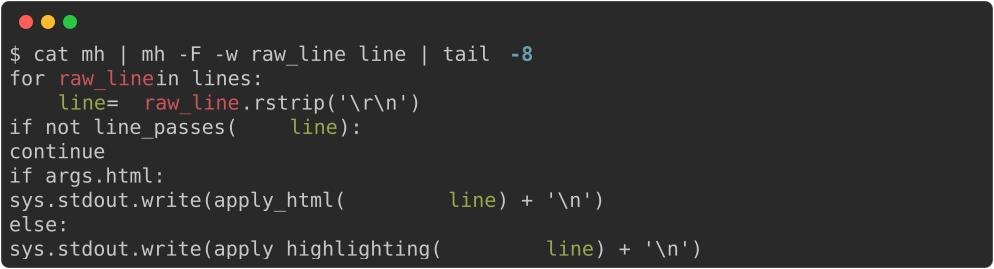
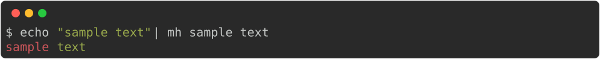
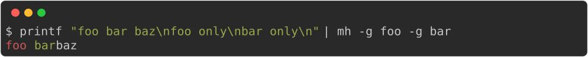
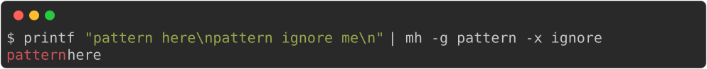
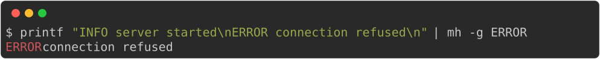
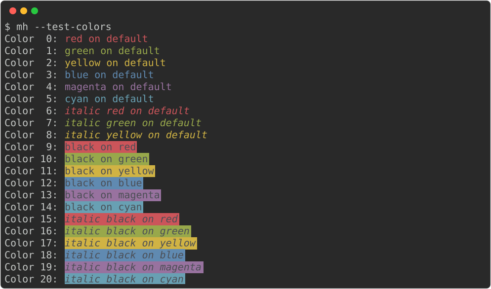

# mh – Multi‑term Highlighter

## Overview

`mh` is a lightweight tool that behaves similar to `grep` but highlights multiple terms using different colors.

`mh` can:
- Highlight unlimited number of terms (unlike GNU grep which highlights only one match)
- Filter input lines, as both `grep` and `grep -v` would.
- Choose pattern match between regular expressions and fixed strings (as `grep` / `grep -F`)
- Case sensitive and whole-word-only matching (as `grep -i` and `grep -w`)
- Use user-configured set of ANSI colors.
- Auto‑rotate colors when there are more patterns than colors.

This is an indispensible tool to interactively and iteratively analyze large volumes
of data such as log files, while keeping visual anchors during investigation.
An analysis session usually looks like:
- use mh to process and output log file
- find an object of interest (e.g. an object id), add highlighting term to `mh`
- add filtering expressions to `mh`
  - hide log lines from a chatty service
  - keep log lines from a particular class
- repeat

Example - highlight variables in the script:

<!-- $ cat mh | mh -F -w raw_line line | tail -8 -->


## Installation

```bash
$ chmod +x mh
$ cp mh ~/bin/mh          # or any directory on $PATH
$ mh --create-config      # optional - write default ~/.config/mh/config.toml
```

The script requires **Python 3.8+** and only uses the standard library.

## Usage

Highlight only – no filtering:

<!-- $ echo "sample text" | mh sample text -->


Filter lines containing both "foo" and "bar" (AND chain):

<!-- $ printf "foo bar baz\nfoo only\nbar only\n" | mh -g foo -g bar -->


Filter but exclude lines containing "ignore":

<!-- $ printf "pattern here\npattern ignore me\n" | mh -g pattern -x ignore -->


Overlapping terms – later terms take precedence:

<!-- $ echo "zzzaaabczzz" | mh aaa abc -->


Filter log lines by level:

<!-- $ printf "INFO server started\nERROR connection refused\n" | mh -g ERROR -->


Test color palette:

<!-- $ mh --test-colors -->


## Configuration

Run `mh --create-config` to write a default config to `~/.config/mh/config.toml`:

```toml
[defaults]
line_buffered = true
ignore_case = false  # true = case-insensitive (-i)
word_match = false   # true = whole-word matching only (-w)
term_matching = "regexp"  # "regexp" or "fixed"
mode = "highlight"        # "highlight", "grep", or "exclude"

colors = [
    "red on default",
    "green on default",
    "yellow on default",
    "blue on default",
    "magenta on default",
    "cyan on default",
    "italic red on default",
    ...
]
```

Each entry is a color spec:

```
[bold] [italic] <fg> [on <bg>]
```

`fg` and `bg` accept any of:

| Format | Example | Notes |
|--------|---------|-------|
| Named color | `red`, `bright_cyan`, `default` | `black` `red` `green` `yellow` `blue` `magenta` `cyan` `white`, plus `bright_` variants |
| 8-bit index | `196` | 0–15: standard colors, 16–231: 6×6×6 color cube, 232–255: greyscale ramp |
| 24-bit hex | `#e06c75` | Full RGB, `#rrggbb` |

Use `default` for fg or bg to leave it unset (inherits from the terminal). The `on <bg>` part is optional and defaults to `on default`.

Examples: `red`, `bold blue on default`, `italic black on red`, `#e06c75 on #282c34`, `bold bright_cyan on 235`.

## License

MIT – feel free to copy, modify, and distribute.
